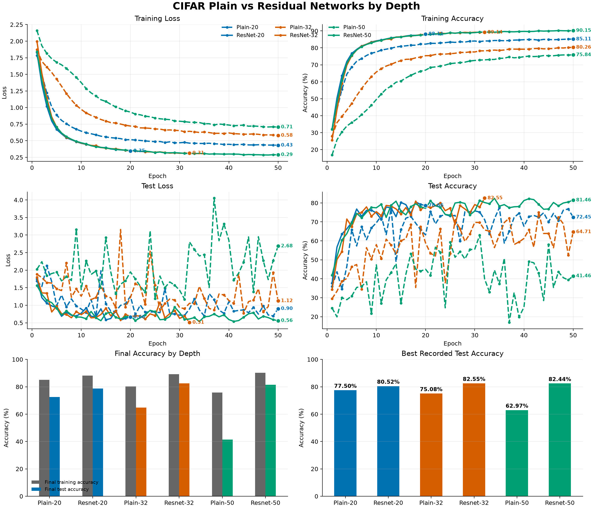
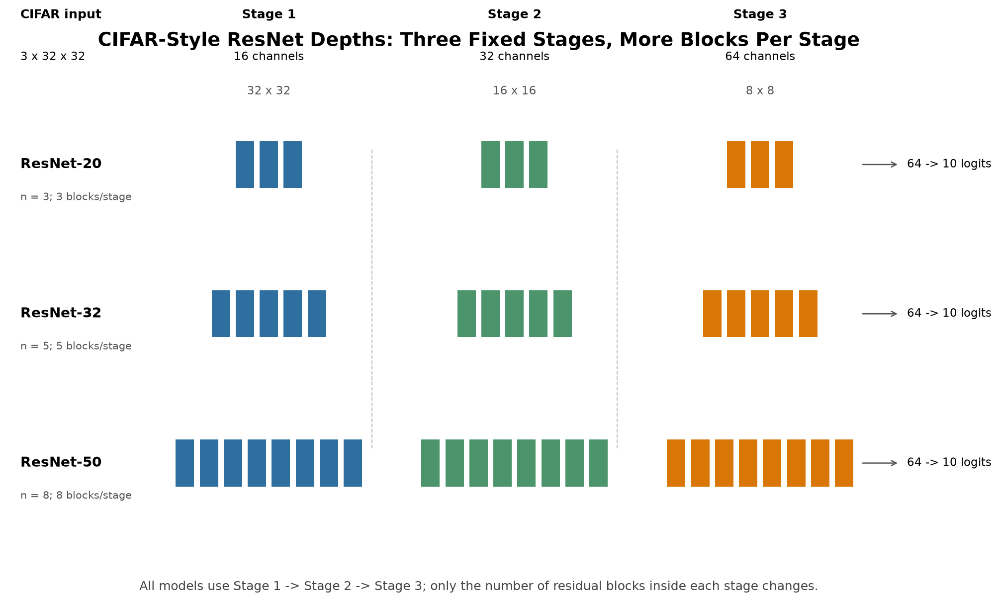

# Ablations and Experimental Results

This document records the controlled depth comparisons in this repository.
The numerical values below are calculated from the CSV files in
`experiments/results/`; the CSVs are not overwritten by the plotting or
documentation workflow.

## 1. ResNet depth experiment

The residual models use the same CIFAR-style architecture family while
varying the paper-style depth relationship:

```text
depth = 6n + 2
```

The three experiments are:

```text
ResNet-20 -> n = 3 -> 3 residual blocks per stage
ResNet-32 -> n = 5 -> 5 residual blocks per stage
ResNet-50 -> n = 8 -> 8 residual blocks per stage
```

All three models keep the same three-stage structure. Stage 1 uses 16
channels at 32 x 32, Stage 2 uses 32 channels at 16 x 16, and Stage 3 uses
64 channels at 8 x 8. Depth changes the number of residual blocks inside
each stage, not the number of stages. The models are CIFAR-style depth-50,
not the standard ImageNet ResNet-50 architecture.

## 2. Training setup

The current training entry point uses:

```text
Dataset: CIFAR-10
Batch size: 128
Optimizer: SGD
Learning rate: 0.1
Momentum: 0.9
Weight decay: 5e-4
Epochs configured in src/train.py: 50
Loss: CrossEntropyLoss
```

The result files do not all contain the configured 50 epochs: ResNet-20 has
20 recorded epochs, ResNet-32 has 32, and ResNet-50 has 50. The tables and
plots use the rows that are actually present.

## 3. ResNet results

| Model | Recorded epochs | Final training loss | Final training accuracy | Final test loss | Final test accuracy | Best test accuracy | Best-test epoch |
| --- | ---: | ---: | ---: | ---: | ---: | ---: | ---: |
| ResNet-20 | 20 | 0.3460 | 88.11% | 0.6616 | 78.66% | 80.52% | 18 |
| ResNet-32 | 32 | 0.3138 | 89.14% | 0.5088 | 82.55% | 82.55% | 32 |
| ResNet-50 | 50 | 0.2882 | 90.15% | 0.5603 | 81.46% | 82.44% | 34 |

The final values are the last rows of `resnet_cifar20.csv`,
`resnet_cifar32.csv`, and `resnet_cifar50.csv`. Best-test epoch is the row
with the highest recorded `test_accuracy` in each file.

## 4. Plain-network context

The paper-inspired plain experiments provide the depth comparison that
motivates the residual experiments:

| Model | Final training loss | Final training accuracy | Final test accuracy | Best test accuracy | Best-test epoch |
| --- | ---: | ---: | ---: | ---: | ---: |
| Plain-20 | 0.4314 | 85.11% | 72.45% | 77.50% | 35 |
| Plain-32 | 0.5796 | 80.26% | 64.71% | 75.08% | 43 |
| Plain-50 | 0.7053 | 75.84% | 41.46% | 62.97% | 31 |

These values come from the corresponding `plain_cifar*.csv` files. The
preliminary `plain_baseline.csv` and `deep_plain.csv` experiments use a
different custom architecture and are retained as historical context rather
than being treated as the controlled CIFAR depth comparison.

## 5. Interpretation

The plain results show lower final training accuracy and higher final
training loss as the controlled plain depth increases from 20 to 50 under
the recorded runs. This is consistent with the optimization behavior being
investigated, but it is not by itself a definitive causal demonstration of
the degradation problem.

The residual runs reach higher final training accuracy than the corresponding
plain runs in these files, and the ResNet-32 and ResNet-50 runs record higher
test accuracy than ResNet-20. These comparisons should be read with the
different recorded epoch counts in mind. Test loss and test accuracy are
also visibly noisier than the training curves, so test metrics describe
generalization rather than optimization alone.

The role of the experiments is therefore:

- Plain networks investigate how optimization behavior changes as depth
	increases.
- Residual networks investigate whether shortcut parameterization makes
	deeper optimization more manageable under the same general training setup.

These are educational ablations under this repository's implementation and
training conditions, not an exact reproduction of every experiment in the
original ResNet paper.

## 6. Figures



*Figure 1. Training loss, training accuracy, test loss, and test accuracy
from every recorded epoch in the matching Plain-20/32/50 and ResNet-20/32/50
CSVs. Colors identify depth; solid lines are residual models and dashed lines
are plain models. The curves are shown without smoothing.*



*Figure 2. All three models use the same three-stage CIFAR architecture;
depth changes the number of residual blocks per stage: 3, 5, or 8.*
